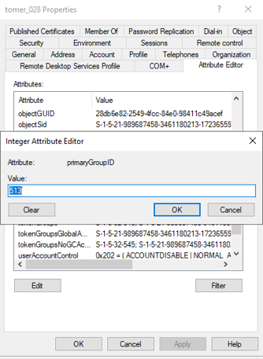

---
# Required metadata
# For more information, see https://review.learn.microsoft.com/en-us/help/platform/learn-editor-add-metadata?branch=main
# For valid values of ms.service, ms.prod, and ms.topic, see https://review.learn.microsoft.com/en-us/help/platform/metadata-taxonomies?branch=main

title: 'Security Assessment: Accounts with non-default Primary Group ID'
description: This recommendation lists all computers and users accounts whose primaryGroupId (PGID) attribute is not the default for domain users and computers in Active Directory. 
author:      LiorShapiraa # GitHub alias
ms.author: liorshapira
ms.service: microsoft-defender-for-identity
ms.topic: article
ms.date:     10/05/2024
---

# Security Assessment: Accounts with non-default Primary Group ID

  
This recommendation lists all computers and users accounts whose primaryGroupId (PGID) attribute is not the default for domain users and computers in Active Directory. 

## Organization risk

The primaryGroupId attribute of a user or computer account grants implicit membership to a group. Membership through this attribute does not appear in the list of group members in some interfaces. This attribute may be used as an attempt to hide group membership. It might be a stealthy way for an attacker to escalate privileges without triggering normal auditing for group membership changes. 

## Remediation steps 

1. Review the list of exposed entities to discover which of your accounts have a suspicious primaryGroupId.  

1. Take appropriate action on those accounts by resetting their attribute to their default values or adding the member to the relevant group:  

  - User accounts: 513 (Domain Users) or 514 (Domain Guests);  
    
  - Computer accounts: 515 (Domain Computers);  
  
  - Domain controller accounts: 516 (Domain Controllers);  
  
  - Read-only domain controller (RODC) accounts: 521 (Read-only Domain Controllers).
  
For example: 

## Next steps

- [Learn more about Microsoft Secure Score](/microsoft-365/security/defender/microsoft-secure-score)

