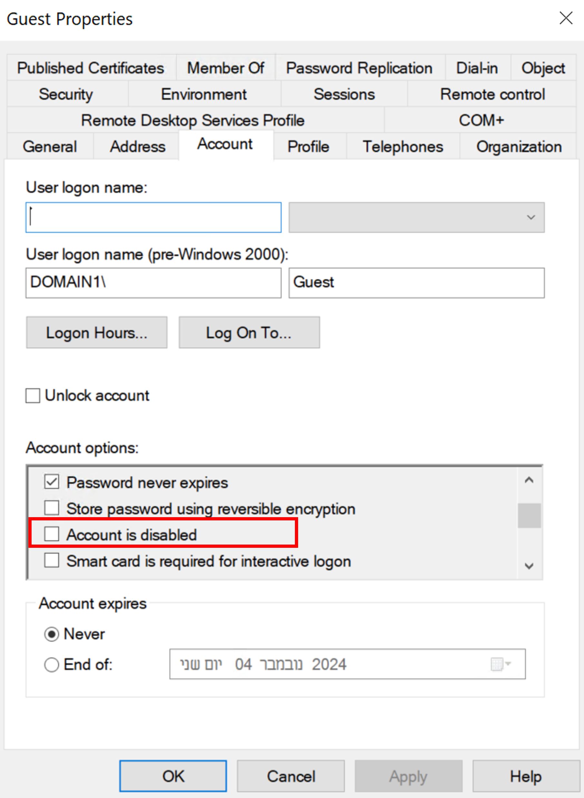

---
# Required metadata
# For more information, see https://review.learn.microsoft.com/en-us/help/platform/learn-editor-add-metadata?branch=main
# For valid values of ms.service, ms.prod, and ms.topic, see https://review.learn.microsoft.com/en-us/help/platform/metadata-taxonomies?branch=main

title:       # Add a title for the browser tab
description: # Add a meaningful description for search results
author:      LiorShapiraa # GitHub alias
ms.author:   t-lshapira # Microsoft alias
ms.service:  # Add the ms.service or ms.prod value
# ms.prod:   # To use ms.prod, uncomment it and delete ms.service
ms.topic:    # Add the ms.topic value
ms.date:     10/05/2024
---

# Security Assessment: Built-in Active Directory Guest account is enabled

This recommendation indicates whether an AD Guest account is enabled in your environment.   
The goal is to **ensure** that the Guest account of the domain is **not enabled**. 

### Organization risk

The on-premises Guest account is a built-in, non-nominative account that allows anonymous access to Active Directory. Enabling this account permits access to the domain without requiring a password, potentially posing a security threat.

### Remediation steps

1. Review the list of exposed entities to discover if there is a Guest account which is enabled.  

1. Take appropriate action on those accounts by **disabling** the account.

For example:

### 

Next steps

[Learn more about Microsoft Secure Score](/microsoft-365/security/defender/microsoft-secure-score)

