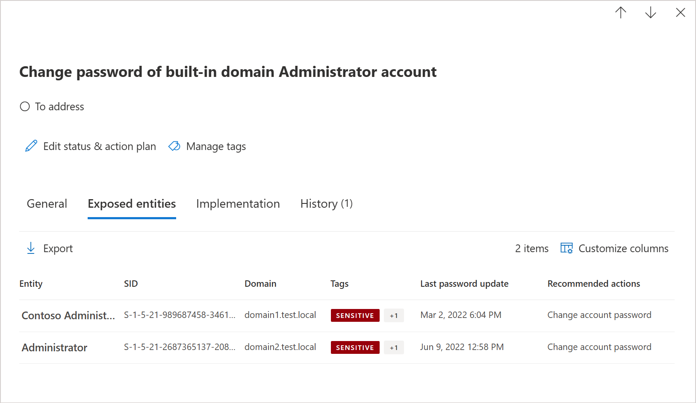

---
# Required metadata
# For more information, see https://review.learn.microsoft.com/en-us/help/platform/learn-editor-add-metadata?branch=main
# For valid values of ms.service, ms.prod, and ms.topic, see https://review.learn.microsoft.com/en-us/help/platform/metadata-taxonomies?branch=main

title: 'Security Assessment: Change password of built-in domain Administrator account'
description: This recommendation lists any built-in domain Administrator accounts within your environment with password last set over 180 days ago. 
author:      LiorShapiraa # GitHub alias
ms.author: liorshapira
ms.service: microsoft-defender-for-identity
ms.topic: article
ms.date:     10/05/2024
---

# Security assessment: Change password of built-in domain Administrator account

This recommendation lists any built-in domain Administrator accounts within your environment with password last set over 180 days ago. 

### Organization risk

The built-in domain Administrator account is a default, highly privileged AD account with full control over the domain. It cannot be deleted, has unrestricted access, and is critical for managing the domain's resources.

Regularly updating the built-in Administrator account's password is essential due to its high privileges, which make it a prime target for attackers. If compromised, it can grant unauthorized control over the domain. Since this account is often unused and its password may not be updated frequently, regular changes reduce exposure and enhance security. 

### Remediation steps 

1. Review the list of exposed entities to discover which of your built-in domain Administrator accounts have an old password.  

1. Take appropriate action on those accounts by resetting their password.  

For example:

### Next steps

- [Learn more about Microsoft Secure Score](/microsoft-365/security/defender/microsoft-secure-score)

