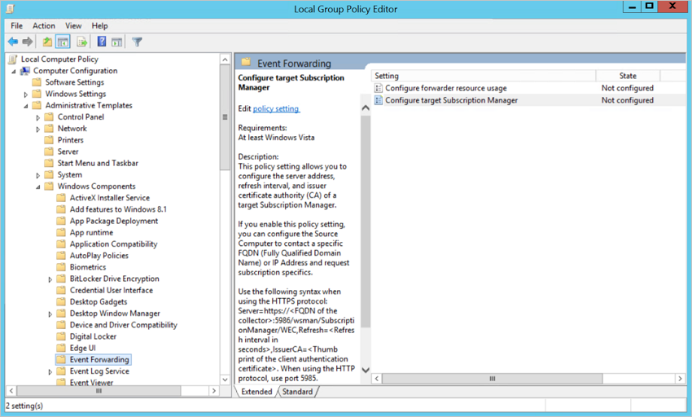
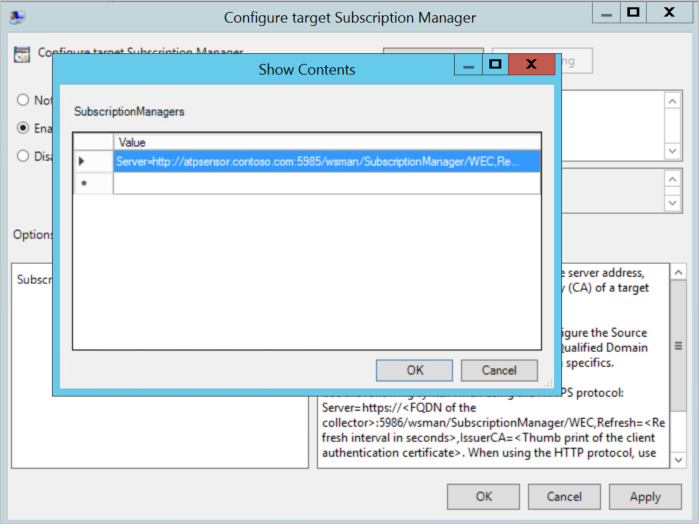
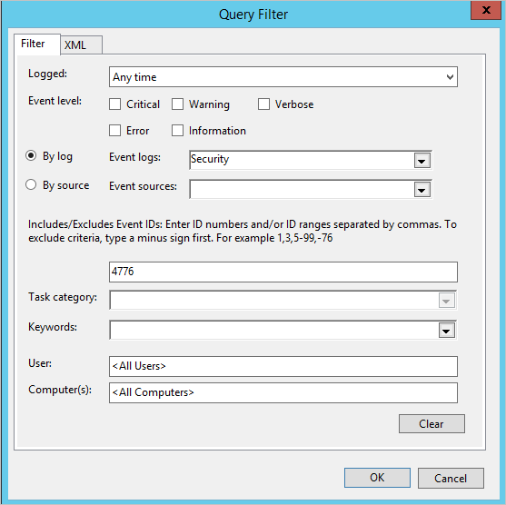

# Configure Windows event forwarding to your Defender for Identity standalone sensor

This article describes an example of how to configure Windows event forwarding to your Microsoft Defender for Identity standalone sensor. Event forwarding is one method for enhancing your detection abilities with extra Windows events that aren't available from the domain controller network. For more information, see [Windows event collection overview](event-collection-overview.md).

> [!IMPORTANT]
>Defender for Identity standalone sensors do not support the collection of Event Tracing for Windows (ETW) log entries that provide the data for multiple detections. For full coverage of your environment, we recommend deploying the Defender for Identity sensor.


## Prerequisites

Before you start:

- Make sure that the domain controller is properly configured to capture the required events. For more information, see [Event collection with Microsoft Defender for Identity](event-collection-overview.md).
- [Configure port mirroring](configure-port-mirroring.md)

## Step 1: Add the network service account to the domain

This procedure describes how to add the network service account to the **Event Log Readers Group** domain. For this scenario, assume that the Defender for Identity standalone sensor is a member of the domain.

1. In Active Directory's Users and Computers, go to the **Built-in** folder and double-click **Event Log Readers**.

1. Select **Members**.

1. If **Network Service** is not listed, select **Add**, and then enter **Network Service** in the **Enter the object names to select** field.

1. Select **Check Names** and select **OK** twice.

After adding the **Network Service** to the **Event Log Readers** group, reboot the domain controllers for the change to take effect.

For more information, see [Active Directory accounts](/windows-server/identity/ad-ds/manage/understand-default-user-accounts).

## Step 2: Create a policy that sets the Configure target setting

This procedure describes how to create a policy on the domain controllers to set the **Configure target** Subscription Manager setting

> [!TIP]
> You can create a group policy for these settings and apply the group policy to each domain controller monitored by the Defender for Identity standalone sensor. The following steps modify the local policy of the domain controller.

1. On each domain controller, run:

    ```cmd
    winrm quickconfig
    ```

1. From a command prompt, enter

    ```cmd
    gpedit.msc
    ```

1. Expand **Computer Configuration > Administrative Templates > Windows Components > Event Forwarding**. For example:

    

1. Double-click **Configure target Subscription Manager** and then:

    1. Select **Enabled**.
    1. Under **Options**, select **Show**.
    1. Under **SubscriptionManagers**, enter the following value and select **OK**:

        **Server=http://`<fqdnMicrosoftDefenderForIdentitySensor>`:5985/wsman/SubscriptionManager/WEC,Refresh=10**
        
        For example, using **Server=http://atpsensor9.contoso.com:5985/wsman/SubscriptionManager/WEC,Refresh=10**:

        

1. Select **OK**.

1. From an elevated command prompt, enter:

    ```cmd
    gpupdate /force
    ```

### Step 3: Create and select a subscription on your sensor

This procedure describes how to create a subscription for use with Defender for Identity and then select it from your standalone sensor.

1. Open an elevated command prompt and enter

    ```cmd
    wecutil qc
    ```

1. Open **Event Viewer**.

1. Right-click **Subscriptions** and select **Create Subscription**.

    1. Enter a name and description for the subscription.

    1. For **Destination Log**, confirm that **Forwarded Events** is selected. For Defender for Identity to read the events, the destination log must be **Forwarded Events**.

    1. Select **Source computer initiated** > **Select Computers Groups** > **Add Domain Computer**.

        1. Enter the name of the domain controller in the **Enter the object name to select** field. 

        1. Select **Check Names** > **OK** > **OK**.

        1. Select **OK**. For example:

            :::image type="content" source="../media/wef-3-event-viewer.png" alt-text="Screenshot of the Event Viewer dialog." lightbox="../media/wef-3-event-viewer.png":::

    1. Select **Select Events** > **By log** > **Security**.

    1. In the **Includes/Excludes Event ID** field type the event number and select **OK**. For example, enter **4776**:
    
        

    1. Return to the command window opened in the first step. Run the following commands, replacing *SubscriptionName* with the name you created for the subscription.

        ```cmd
        wecutil ss "SubscriptionName" /cm:"Custom"
        wecutil ss "SubscriptionName" /HeartbeatInterval:5000
        ```

    1. Return to the **Event Viewer** console. Right-click the created subscription and select **Runtime Status** to see if there are any issues with the status.

    1. After a few minutes, check to see that the events you set to be forwarded is showing up in the Forwarded Events on the Defender for Identity standalone sensor.

For more information, see: [Configure the computers to forward and collect events](/previous-versions/windows/it-pro/windows-server-2008-R2-and-2008/cc748890(v=ws.11)).

## Related content

For more information, see:

- [Configure port mirroring](configure-port-mirroring.md)
- [Listen for SIEM events on your Defender for Identity standalone sensor](configure-event-collection.md)
