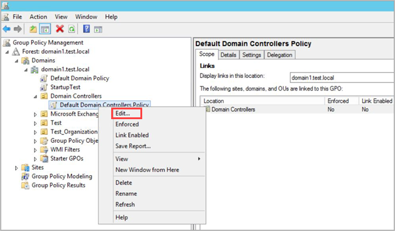
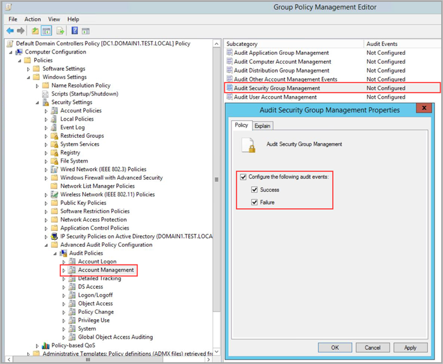
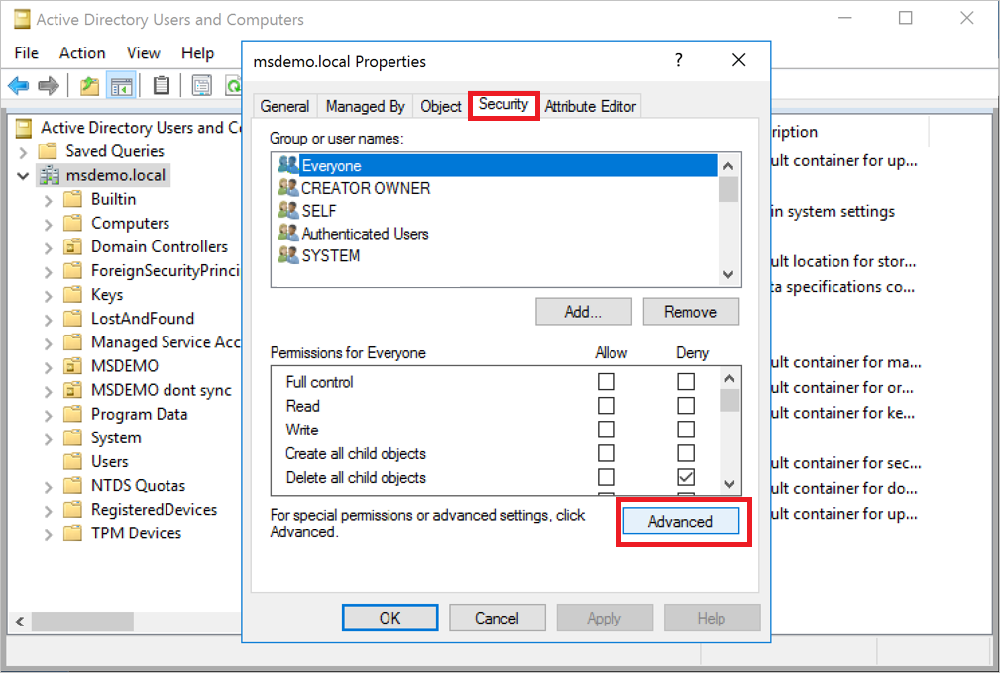
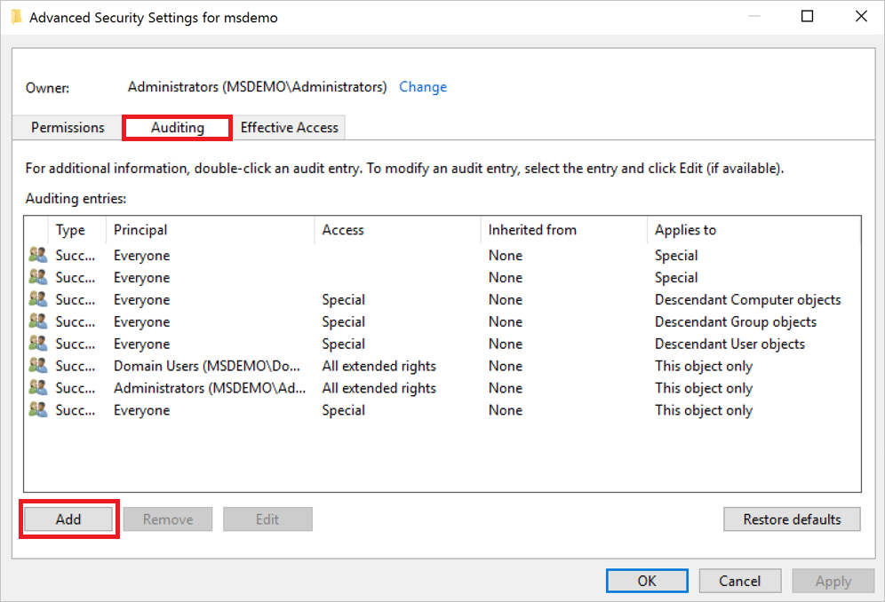
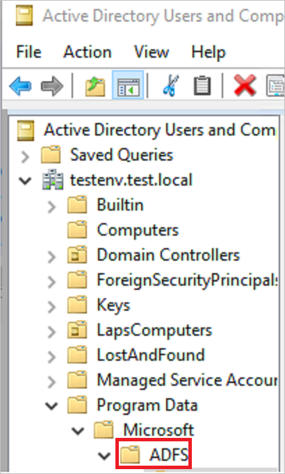

# Configure audit policies for Windows event logs

To enhance detections and gather more information on user actions like NTLM logons and security group changes, Microsoft Defender for Identity relies on specific entries in Windows event logs. Proper configuration of Advanced Audit Policy settings on your domain controllers is crucial to avoid gaps in the event logs and incomplete Defender for Identity coverage.

This article describes how to configure your Advanced Audit Policy settings as needed for a Defender for Identity sensor. It also describes other configurations for specific event types.

Defender for Identity generates health issues for each of these scenarios if they're detected. For more information, see [Microsoft Defender for Identity health issues](../health-alerts.md).

## Prerequisites

- Before you run Defender for Identity PowerShell commands, make sure that you downloaded the [Defender for Identity PowerShell module](https://www.powershellgallery.com/packages/DefenderForIdentity/).

## Generate a report of current configurations via PowerShell

Before you start creating new event and audit policies, we recommend that you run the following PowerShell command to generate a report of your current domain configurations:

```powershell
New-MDIConfigurationReport [-Path] <String> [-Mode] <String> [-OpenHtmlReport]
```

In the preceding command:

- `Path` specifies the path to save the reports to.
- `Mode` specifies whether you want to use `Domain` or `LocalMachine` mode. In `Domain` mode, the settings are collected from the Group Policy objects (GPOs). In `LocalMachine` mode, the settings are collected from the local machine.
- `OpenHtmlReport` opens the HTML report after the report is generated.

For example, to generate a report and open it in your default browser, run the following command:

```powershell
New-MDIConfigurationReport -Path "C:\Reports" -Mode Domain -OpenHtmlReport
```

For more information, see the [DefenderforIdentity PowerShell reference](/powershell/module/defenderforidentity/new-mdiconfigurationreport).

> [!TIP]
> The `Domain` mode report includes only configurations set as group policies on the domain. If you have settings defined locally on your domain controllers, we recommend that you also run the [Test-MdiReadiness.ps1](https://github.com/microsoft/Microsoft-Defender-for-Identity/tree/main/Test-MdiReadiness) script.

## Configure auditing for domain controllers

Update your Advanced Audit Policy settings and extra configurations for specific events and event types, such as users, groups, computers, and more. Audit configurations for domain controllers include:

- Advanced Audit Policy settings
- [NTLM auditing](#configure-ntlm-auditing)
- [Domain object auditing](#configure-domain-object-auditing)

Use the following procedures to configure auditing on the domain controllers that you're using with Defender for Identity.

### Configure Advanced Audit Policy settings from the UI

This procedure describes how to modify your domain controller's Advanced Audit Policy settings as needed for Defender for Identity via the UI.

**Related health issue:** [Directory Services Advanced Auditing is not enabled as required](../health-alerts.md#directory-services-advanced-auditing-is-not-enabled-as-required)

To configure your Advanced Audit Policy settings:

1. Sign in to the server as **Domain Administrator**.
1. Open the Group Policy Management Editor from **Server Manager** > **Tools** > **Group Policy Management**.
1. Expand **Domain Controllers Organizational Units**, right-click  **Default Domain Controllers Policy**, and then select **Edit**.

    

    > [!NOTE]
    > Use the Default Domain Controllers policy or a dedicated GPO to set these policies.

1. In the window that opens, go to **Computer Configuration** > **Policies** > **Windows Settings** > **Security Settings**. Depending on the policy you want to enable, do the following:

    1. Go to **Advanced Audit Policy Configuration** > **Audit Policies**.

        

    1. Under **Audit Policies**, edit each of the following policies and select **Configure the following audit events** for both **Success** and **Failure** events.

        | Audit policy | Subcategory | Triggers event IDs |
        | --- |---|---|
        | **Account Logon** | **Audit Credential Validation** | 4776 |
        | **Account Management** | **Audit Computer Account Management**<sup>[*](#failure)</sup> | 4741, 4743 |
        | **Account Management** | **Audit Distribution Group Management**<sup>[*](#failure)</sup> | 4753, 4763 |
        | **Account Management** | **Audit Security Group Management**<sup>[*](#failure)</sup> | 4728, 4729, 4730, 4732, 4733, 4756, 4757, 4758 |
        | **Account Management** | **Audit User Account Management** | 4726 |
        | **DS Access** | **Audit Directory Service Changes** | 5136  |
        | **System** | **Audit Security System Extension**<sup>[*](#failure)</sup> | 7045 |
        | **DS Access** | **Audit Directory Service Access** | 4662 - For this event, you must also [configure domain object auditing](#configure-domain-object-auditing).  |

        > [!NOTE]
        > <a name=failure>*</a> Noted subcategories don't support failure events. However, we recommend adding them for auditing purposes in case they're implemented in the future. For more information, see [Audit Computer Account Management](/windows/security/threat-protection/auditing/audit-computer-account-management), [Audit Security Group Management](/windows/security/threat-protection/auditing/audit-security-group-management), and [Audit Security System Extension](/windows/security/threat-protection/auditing/audit-security-system-extension).

        For example, to configure **Audit Security Group Management**, under **Account Management**, double-click **Audit Security Group Management**, and then select **Configure the following audit events** for both **Success** and **Failure** events.

        

1. From an elevated command prompt, enter `gpupdate`.

1. After you apply the policy via GPO, conform that the new events appear in the Event Viewer, under **Windows Logs** > **Security**.

To test your audit policies from the command line, run the following command:

```cmd
auditpol.exe /get /category:*
```

For more information, see the [auditpol reference documentation](/windows-server/administration/windows-commands/auditpol).

### Configure Advanced Audit Policy settings by using PowerShell

The following actions describe how to modify your domain controller's Advanced Audit Policy settings as needed for Defender for Identity by using PowerShell.

**Related health issue:** [Directory Services Advanced Auditing is not enabled as required](../health-alerts.md#directory-services-advanced-auditing-is-not-enabled-as-required)

To configure your settings, run:

```powershell
Set-MDIConfiguration [-Mode] <String> [-Configuration] <String[]> [-CreateGpoDisabled] [-SkipGpoLink] [-Force]
```

In the preceding command:

- `Mode` specifies whether you want to use `Domain` or `LocalMachine` mode. In `Domain` mode, the settings are collected from the Group Policy objects. In `LocalMachine` mode, the settings are collected from the local machine.
- `Configuration` specifies which configuration to set. Use `All` to set all configurations.
- `CreateGpoDisabled` specifies if the GPOs are created and kept as disabled.
- `SkipGpoLink` specifies that GPO links aren't created.
- `Force` specifies that the configuration is set or GPOs are created without validating the current state.

To view your audit policies, use the `Get-MDIConfiguration` command to show current values:

```powershell
Get-MDIConfiguration [-Mode] <String> [-Configuration] <String[]>
```

In the preceding command:

- `Mode` specifies whether you want to use `Domain` or `LocalMachine` mode. In `Domain` mode, the settings are collected from the Group Policy objects. In `LocalMachine` mode, the settings are collected from the local machine.
- `Configuration` specifies which configuration to get. Use `All` to get all configurations.

To test your audit policies, use the `Test-MDIConfiguration` command to get a `true` or `false` response as to whether the values are configured correctly:

```powershell
Test-MDIConfiguration [-Mode] <String> [-Configuration] <String[]>
```

In the preceding command:

- `Mode` specifies whether you want to use `Domain` or `LocalMachine` mode. In `Domain` mode, the settings are collected from the Group Policy objects. In `LocalMachine` mode, the settings are collected from the local machine.
- `Configuration` specifies which configuration to test. Use `All` to test all configurations.

For more information, see the following [DefenderForIdentity PowerShell references](/powershell/defenderforidentity/overview-defenderforidentity):

- [Set-MDIConfiguration](/powershell/module/defenderforidentity/set-mdiconfiguration)
- [Get-MDIConfiguration](/powershell/module/defenderforidentity/get-mdiconfiguration)
- [Test-MDIConfiguration](/powershell/module/defenderforidentity/test-mdiconfiguration)

### Configure NTLM auditing

This section describes the extra configuration steps that you need for auditing Windows event 8004.

> [!NOTE]
>
> - Domain group policies to collect Windows event 8004 should be applied *only* to domain controllers.
> - When a Defender for Identity sensor parses Windows event 8004, Defender for Identity NTLM authentication activities are enriched with the server-accessed data.

**Related health issue:** [NTLM Auditing is not enabled](../health-alerts.md#ntlm-auditing-is-not-enabled)

To configure NTLM auditing:

1. After you configure your initial Advanced Audit Policy settings (via the [UI](#configure-advanced-audit-policy-settings-from-the-ui) or [PowerShell](#configure-advanced-audit-policy-settings-by-using-powershell)), open **Group Policy Management**. Then go to **Default Domain Controllers Policy** > **Local Policies** > **Security Options**.

1. Configure the specified security policies as follows:

    | Security policy setting | Value |
    |---|---|
    | **Network security: Restrict NTLM: Outgoing NTLM traffic to remote servers** | Audit all |
    | **Network security: Restrict NTLM: Audit NTLM authentication in this domain** | Enable all |
    | **Network security: Restrict NTLM: Audit Incoming NTLM Traffic** | Enable auditing for all accounts |

For example, to configure **Outgoing NTLM traffic to remote servers**, under **Security Options**, double-click **Network security: Restrict NTLM: Outgoing NTLM traffic to remote servers**, and then select **Audit all**.

:::image type="content" source="../media/advanced-audit-policy-check-step-3.png" alt-text="Screenshot of the audit configuration for outgoing NTLM traffic to remote servers." border="false":::

### Configure domain object auditing

To collect events for object changes, such as event 4662, you must also configure object auditing on the user, group, computer, and other objects. The following procedure describes how to enable auditing in the Active Directory domain.

> [!IMPORTANT]
> Review and audit your policies (via the [UI](#configure-advanced-audit-policy-settings-from-the-ui) or [PowerShell](#configure-advanced-audit-policy-settings-by-using-powershell)) before you enable event collection, to ensure that the domain controllers are properly configured to record the necessary events. If this auditing is configured properly, it should have a minimal effect on server performance.

**Related health issue:** [Directory Services Object Auditing is not enabled as required](../health-alerts.md#directory-services-object-auditing-is-not-enabled-as-required)

To configure domain object auditing:

1. Go to the **Active Directory Users and Computers** console.
1. Select the domain that you want to audit.
1. Select the **View** menu, and then select **Advanced Features**.
1. Right-click the domain and select **Properties**.

    

1. Go to the **Security** tab, and then select **Advanced**.

    

1. In **Advanced Security Settings**, select the **Auditing** tab, and then select **Add**.

    

1. Choose **Select a principal**.

    

1. Under **Enter the object name to select**, enter **Everyone**. Then select **Check Names** > **OK**.

    

1. You then return to **Auditing Entry**. Make the following selections:

    1. For **Type**, select **Success**.
    1. For **Applies to**, select **Descendant User objects**.
    1. Under **Permissions**, scroll down and select the **Clear all** button.

        :::image type="content" source="../media/clear-all.png" alt-text="Screenshot of the button for clearing all permissions.":::

    1. Scroll back up and select **Full Control**. All the permissions are selected.

    1. Clear the selection for the **List contents**, **Read all properties**, and **Read permissions** permissions, and then select **OK**. This step sets all the **Properties** settings to **Write**.

        

        Now, all relevant changes to directory services appear as 4662 events when they're triggered.

1. Repeat the steps in this procedure, but for **Applies to**, select the following object types:
   - **Descendant Group Objects**
   - **Descendant Computer Objects**
   - **Descendant msDS-GroupManagedServiceAccount Objects**
   - **Descendant msDS-ManagedServiceAccount Objects**

> [!NOTE]
> Assigning the auditing permissions on **All descendant objects** would also work, but you need only the object types detailed in the last step.

## Configure auditing on AD FS

**Related health issue:** [Auditing on the AD FS container is not enabled as required](../health-alerts.md#auditing-on-the-adfs-container-is-not-enabled-as-required)

To configure auditing on Active Directory Federation Services (AD FS):

1. Go to the **Active Directory Users and Computers** console, and select the domain where you want to enable the logs.

1. Go to **Program Data** > **Microsoft** > **ADFS**.

    

1. Right-click **ADFS** and select **Properties**.
1. Go to the **Security** tab and select **Advanced** > **Advanced Security Settings**. Then go to the **Auditing** tab and select **Add** > **Select a principal**.
1. Under **Enter the object name to select**, enter **Everyone**. Then select **Check Names** > **OK**.
1. You then return to **Auditing Entry**. Make the following selections:

    - For **Type**, select **All**.
    - For **Applies to**, select **This object and all descendant objects**.
    - Under **Permissions**, scroll down and select **Clear all**. Scroll up and select **Read all properties** and **Write all properties**.

    

1. Select **OK**.

## Configure auditing on AD CS

If you're working with a dedicated server that has Active Directory Certificate Services (AD CS) configured, configure auditing as follows to view dedicated alerts and Secure Score reports:

1. Create a group policy to apply to your AD CS server. Edit it and configure the following auditing settings:

   1. Go to **Computer Configuration\Policies\Windows Settings\Security Settings\Advanced Audit Policy Configuration\Audit Policies\Object Access\Audit Certification Services**.

   1. Select the checkboxes to configure audit events for **Success** and **Failure**.

      :::image type="content" source="../media/configure-windows-event-collection/group-policy-management-editor.png" alt-text="Screenshot of configuring audit events for Active Directory Certificate Services in the Group Policy Management Editor.":::

1. Configure auditing on the certificate authority (CA) by using one of the following methods:

   - To configure CA auditing by using the command line, run:

     ```cmd
     certutil –setreg CA\AuditFilter 127 
   
   
     net stop certsvc && net start certsvc
     ````

   - To configure CA auditing by using the GUI:

     1. Select **Start** > **Certification Authority (MMC Desktop application)**. Right-click your CA's name and select **Properties**.

        :::image type="content" source="../media/configure-windows-event-collection/certification-authority.png" alt-text="Screenshot of the Certification Authority dialog.":::

     1. Select the **Auditing** tab, select all the events that you want to audit, and then select **Apply**.

        :::image type="content" source="../media/configure-windows-event-collection/auditing.png" alt-text="Screenshot of the Auditing tab for certificate authority properties.":::

> [!NOTE]
> Configuring **Start and Stop Active Directory Certificate Services** event auditing might cause restart delays when you're dealing with a large AD CS database. Consider removing irrelevant entries from the database. Alternatively, refrain from enabling this specific type of event.

## Configure auditing on Microsoft Entra Connect

To configure auditing on Microsoft Entra Connect servers:

- Create a group policy to apply to your Microsoft Entra Connect servers. Edit it and configure the following auditing settings:

   1. Go to **Computer Configuration\Policies\Windows Settings\Security Settings\Advanced Audit Policy Configuration\Audit Policies\Logon/Logoff\Audit Logon**.

   1. Select the checkboxes to configure audit events for **Success** and **Failure**.


## Configure auditing on the configuration container
<a name="enable-auditing-on-an-exchange-object"></a>

**Related health issue:** [Auditing on the Configuration container is not enabled as required](../health-alerts.md#auditing-on-the-configuration-container-is-not-enabled-as-required)

1. Open the ADSI Edit tool. Select **Start** > **Run**, enter `ADSIEdit.msc`, and then select **OK**.

1. On the **Action** menu, select **Connect to**.

1. In the **Connection Settings** dialog, under **Select a well known Naming Context**, select **Configuration** > **OK**.

1. Expand the **Configuration** container to show the **Configuration** node, which begins with **"CN=Configuration,DC=..."**.

1. Right-click the **Configuration** node and select **Properties**.

    

1. Select the **Security** tab, and then select **Advanced**.

1. In **Advanced Security Settings**, select the **Auditing** tab, and then select **Add**.

1. Choose **Select a principal**.

1. Under **Enter the object name to select**, enter **Everyone**. Then select **Check Names** > **OK**.

1. You then return to **Auditing Entry**. Make the following selections:

    - For **Type**, select **All**.
    - For **Applies to**, select **This object and all descendant objects**.
    - Under **Permissions**, scroll down and select **Clear all**. Scroll up and select **Write all properties**.

    

1. Select **OK**.

## Update legacy configurations

Defender for Identity no longer requires logging 1644 events. If you have this registry setting enabled, you can remove it.

```reg
Windows Registry Editor Version 5.00
[HKEY_LOCAL_MACHINE\SYSTEM\CurrentControlSet\Services\NTDS\Diagnostics]
"15 Field Engineering"=dword:00000005

[HKEY_LOCAL_MACHINE\SYSTEM\CurrentControlSet\Services\NTDS\Parameters]
"Expensive Search Results Threshold"=dword:00000001
"Inefficient Search Results Threshold"=dword:00000001
"Search Time Threshold (msecs)"=dword:00000001
```

## Related content

For more information, see:

- [Event collection with Microsoft Defender for Identity](event-collection-overview.md)
- [Windows security auditing](/windows/security/threat-protection/auditing/security-auditing-overview)
- [Advanced security audit policies](/windows/security/threat-protection/auditing/advanced-security-auditing)

## Next step

> [!div class="step-by-step"]
> [What are Defender for Identity roles and permissions?](../role-groups.md)
