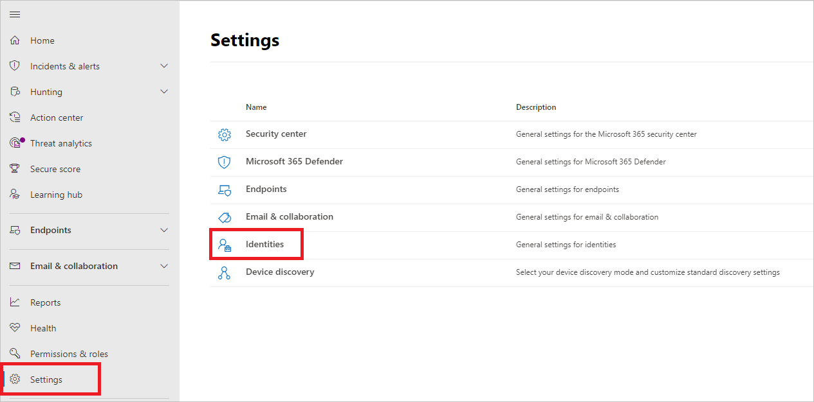
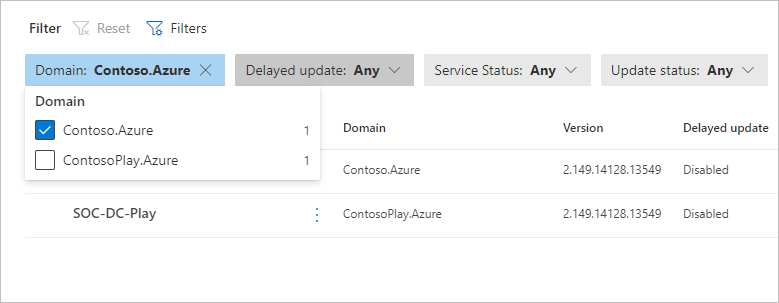
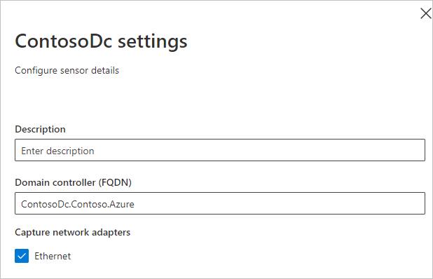
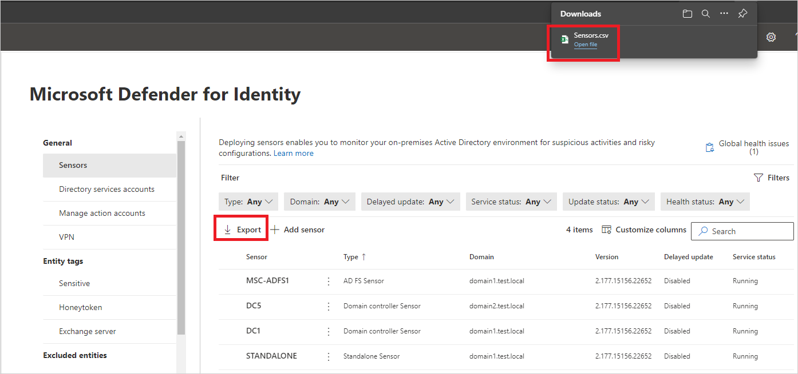
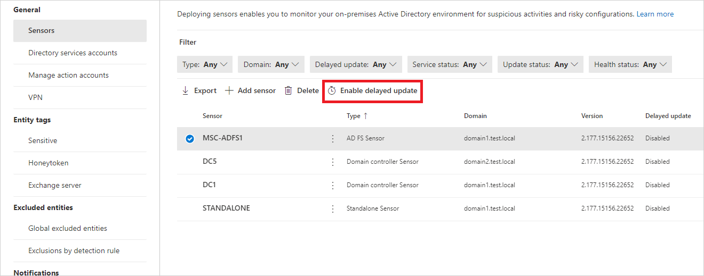

# Manage and update Microsoft Defender for Identity sensors

This article explains how to configure and manage Microsoft Defender for Identity sensors in [Microsoft Defender XDR](/microsoft-365/security/defender/overview-security-center).

## View Defender for Identity sensor settings and status

1. In [Microsoft Defender XDR](https://security.microsoft.com), go to **Settings** and then **Identities**.

    

1. Select the **Sensors** page, which displays all of your Defender for Identity sensors. For each sensor, you'll see its name, its domain membership, the version number, if updates should be delayed, the service status, sensor status, health status, the number of health issues, and when the sensor was created. For details about each column, see [Sensor details](#sensor-details).

    [](media/sensor-page.png#lightbox)

1. If you select **Filters**, you can choose which filters will be available. Then with each filter, you can choose which sensors to display.

    [](media/sensor-filters.png#lightbox)

    

1. If you select one of the sensors, a pane will display with information about the sensor and its health status.

    [](media/sensor-details.png#lightbox)

1. If you select any of the health issues, you'll get a pane with more details about them. If you choose a closed issue, you can reopen it from here.

    

1. If you select **Manage sensor**, a pane will open where you can configure the sensor details.

    

    

1. In the **Sensors** page, you can export your list of sensors to a .csv file by selecting **Export**.

    

## Sensor details

The sensors page provides the following information about each sensor:

* **Sensor**: Displays the sensor's NetBIOS computer name.

* **Type**:  Displays the type of the sensor. Possible values are:

  * **Domain controller sensor**

  * **AD FS sensor** (Active Directory Federation Services)

  * **Standalone sensor**
 
  * **ADCS sensor** (Active Directory Certificate Services). If your sensor is installed on a domain controller server with AD CS configured, such as in a testing environment, the sensor type is shown as **Domain controller sensor** instead.

* **Domain**: Displays the fully qualified domain name of the Active Directory domain where the sensor is installed.

* **Service Status**:  Displays the status of the sensor service on the server. Possible values are:

  * **Running**: Sensor service is running

  * **Starting**: Sensor service is starting

  * **Disabled**: Sensor service is disabled

  * **Stopped**: Sensor service is stopped

  * **Unknown**: Sensor is disconnected or unreachable

* **Sensor Status**:  Displays the overall status of the sensor. Possible values are:

  * **Up to date**: Sensor is running a current version of the sensor.

  * **Outdated**: Sensor is running a version of the software that is at least three versions behind the current version.

  * **Updating**: Sensor software is being updated.

  * **Update failed**: Sensor failed to update to a new version.

  * **Not Configured**: Sensor requires more configuration before it's fully operational. This applies to sensors installed on AD FS / AD CS servers or standalone sensors.

  * **Start failed**: Sensor didn't pull configuration for more than 30 minutes.

  * **Syncing**: Sensor has configuration updates pending, but it didn't yet pull the new configuration.

  * **Disconnected**: The Defender for Identity service hasn't seen any communication from this sensor in 10 minutes.

  * **Unreachable**: The domain controller was deleted from Active Directory. However, the sensor installation wasn't uninstalled and removed from the domain controller before it was decommissioned. You can safely delete this entry.

* **Version**:  Displays the sensor version installed.

* **Delayed update**: Displays the sensor's delayed update mechanism state. Possible values are:

  * Enabled

  * Disabled

* **Health status**: Displays the overall health status of the sensor with a colored icon representing the highest severity open health alert. Possible values are:

  * **Healthy (green icon)**: No opened health issues

  * **Not-healthy (yellow icon)**: The highest severity opened health issue is low

  * **Not-healthy (orange icon)**: The highest severity opened health issue is medium

  * **Not-healthy (red icon)**: The highest severity opened health issue is high

* **Health issues**: Displays the count of opened health issues on the sensor.

* **Created**: Displays the date the sensor was installed

## Updating your sensors

Keeping your Microsoft Defender for Identity sensors up to date, provides the best possible protection for your organization.

The Microsoft Defender for Identity service is typically updated a few times a month with new detections, features, and  performance improvements. Typically these updates include a corresponding minor update to the sensors. Sensor update packages only control the Defender for Identity sensor and sensor detection capabilities.

### Defender for Identity sensor update types

Defender for Identity sensors support two kinds of updates:

* Minor version updates:
  * Frequent
  * Requires no MSI install, and no registry changes
  * Restarted: Defender for Identity sensor services
  
* Major version updates:
  * Rare
  * Contains significant changes
  * Restarted: Defender for Identity sensor services
  
> [!NOTE]
>
> * Defender for Identity sensors always reserve at least 15% of the available memory and CPU available on the domain controller where it is installed. If the Defender for Identity service consumes too much memory, the service is automatically stopped and restarted by the Defender for Identity sensor updater service.

### Delayed sensor update

Given the rapid speed of ongoing Defender for Identity development and release updates, you may decide to define a subset group of your sensors as a delayed update ring, allowing for a gradual sensor update process. Defender for Identity enables you to choose how your sensors are updated and set each sensor as a **Delayed update** candidate.

Sensors not selected for delayed update are updated automatically, each time the Defender for Identity service is updated. Sensors set to **Delayed update** are updated on a delay of 72 hours, following the official release of each service update.

The **delayed update** option enables you to select specific sensors as an automatic update ring, on which all updates are rolled out automatically, and set the rest of your sensors to update on delay, giving you time to confirm that the automatically updated sensors were successful.

> [!NOTE]
> If an error occurs and a sensor does not update, open a support ticket. To further harden your proxy to only communicate with your workspace, see [Proxy configuration](configure-proxy.md).

Authentication between your sensors and the Azure cloud service uses strong, certificate-based mutual authentication. The client certificate is created at the sensor installation as a self-signed certificate, valid for 2 years. The Sensor Updater service is responsible for generating a new self-signed certificate before the existing certificate expires. The certificates are rolled with a 2-phase validation process against the backend to avoid a situation where a rolling certificate breaks the authentication.

Each update is tested and validated on all supported operating systems to cause minimal impact to your network and operations.

To set a sensor to delayed update:

1. In the **Sensors** page, select the sensor you want to set for delayed updates.
1. Select the **Enabled delayed update** button.

    

1. In the confirmation window, select **Enable**.

To disable delayed updates, select the sensor and then select the **Disabled delayed update** button.

### Sensor update process

Every few minutes, Defender for Identity sensors check whether they have the latest version. After the Defender for Identity cloud service is updated to a newer version, the Defender for Identity sensor service starts the update process:

1. Defender for Identity cloud service updates to the latest version.
1. Defender for Identity sensor updater service learns that there's an updated version.
1. Sensors that aren't set to **Delayed update** start the update process on a sensor by sensor basis:
    1. Defender for Identity sensor updater service pulls the updated version from the cloud service (in cab file format).
    1. Defender for Identity sensor updater validates the file signature.
    1. Defender for Identity sensor updater service extracts the cab file to a new folder in the sensor's installation folder. By default it's extracted to *C:\Program Files\Azure Advanced Threat Protection Sensor\<version number>*
    1. Defender for Identity sensor service points to the new files extracted from the cab file.
    1. Defender for Identity sensor updater service restarts the Defender for Identity sensor service.
        > [!NOTE]
        > Minor sensor updates install no MSI, change no registry values or any system files. Even a pending restart does not impact a sensor update.
    1. Sensors run based on the newly updated version.
    1. Sensor receives clearance from the Azure cloud service. You can verify sensor status in the **Sensors** page.
    1. The next sensor starts the update process.

1. Sensors selected for **Delayed update** start their update process 72 hours after the Defender for Identity cloud service is updated. These sensors will then use the same update process as automatically updated sensors.

For any sensor that fails to complete the update process, a relevant [health alert](health-alerts.md#sensor-outdated) is triggered, and is sent as a notification.


### Silently update the Defender for Identity sensor

Use the following command to silently update the Defender for Identity sensor:

**Syntax**:

```cmd
"Azure ATP sensor Setup.exe" [/quiet] [/Help] [NetFrameworkCommandLineArguments="/q"]
```

**Installation options**:

> [!div class="mx-tableFixed"]
>
> |Name|Syntax|Mandatory for silent installation?|Description|
> |-------------|----------|---------|---------|
> |Quiet|/quiet|Yes|Runs the installer displaying no UI and no prompts.|
> |Help|/help|No|Provides help and quick reference. Displays the correct use of the setup command including a list of all options and behaviors.|
> |NetFrameworkCommandLineArguments="/q"|NetFrameworkCommandLineArguments="/q"|Yes|Specifies the parameters for the .Net Framework installation. Must be set to enforce the silent installation of .Net Framework.|

**Examples**:

To update the Defender for Identity sensor silently:

```cmd
"Azure ATP sensor Setup.exe" /quiet NetFrameworkCommandLineArguments="/q"
```

## Configure proxy settings

We recommend that you configure initial proxy settings during installation [using command line switches](deploy/install-sensor.md#defender-for-identity-silent-installation). If you need to update your proxy settings later on, use either the [CLI](deploy/configure-proxy.md#change-proxy-configuration-using-the-cli) or [PowerShell](deploy/configure-proxy.md#change-proxy-configuration-using-powershell).

If you'd previously configured your proxy settings via either WinINet or a registry key and need to update them, you'll need to [use the same method](deploy/configure-proxy.md#change-proxy-configuration-using-legacy-methods) you used originally.

For more information, see [Configure endpoint proxy and internet connectivity settings](deploy/configure-proxy.md).

## Next steps

* [Configure event forwarding](deploy/configure-event-forwarding.md)
* [Defender for Identity prerequisites](deploy/prerequisites.md)
* [Check out the Defender for Identity forum!](<https://aka.ms/MDIcommunity>)
